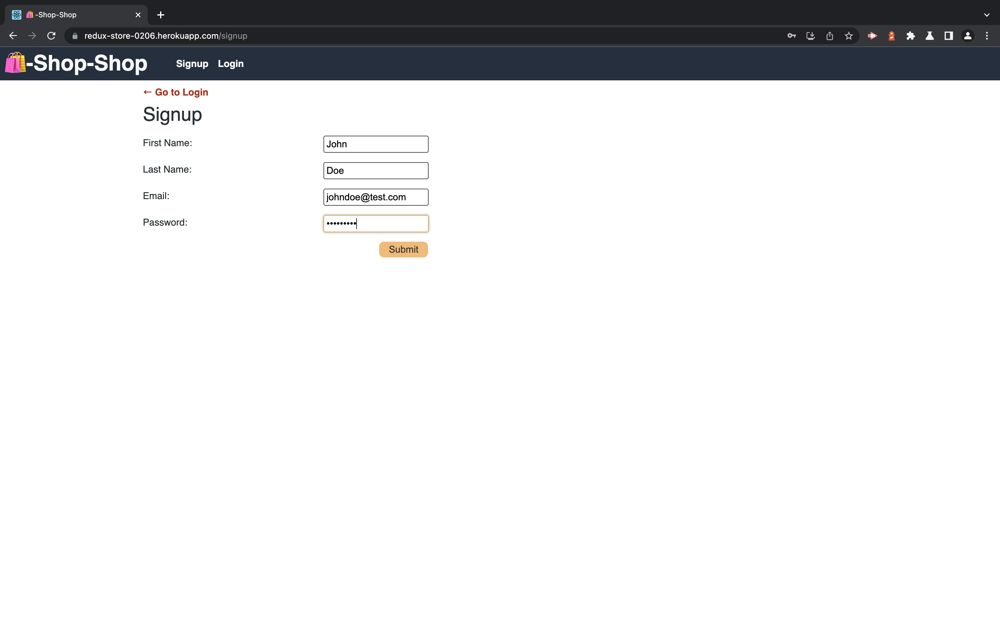
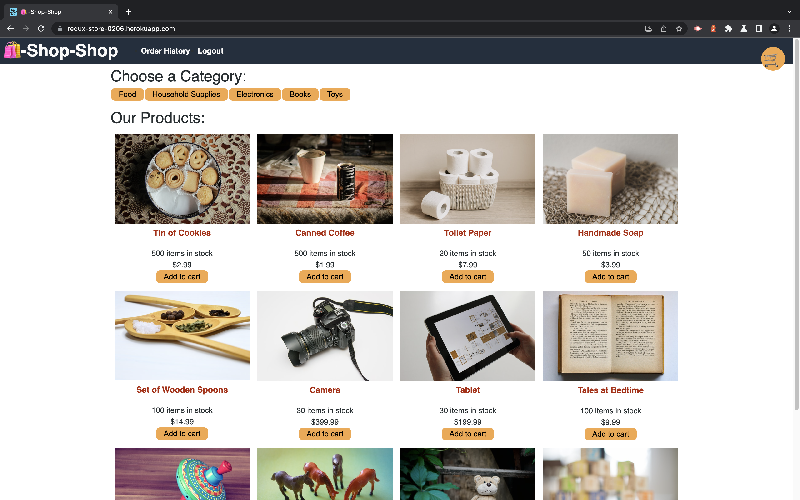
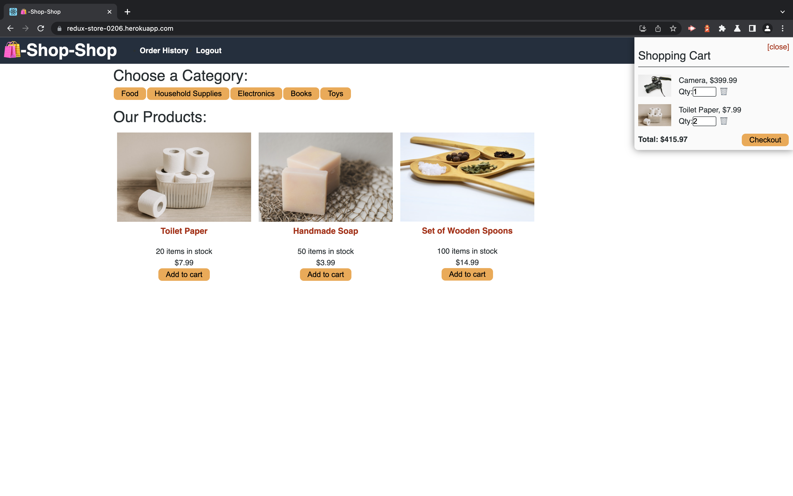
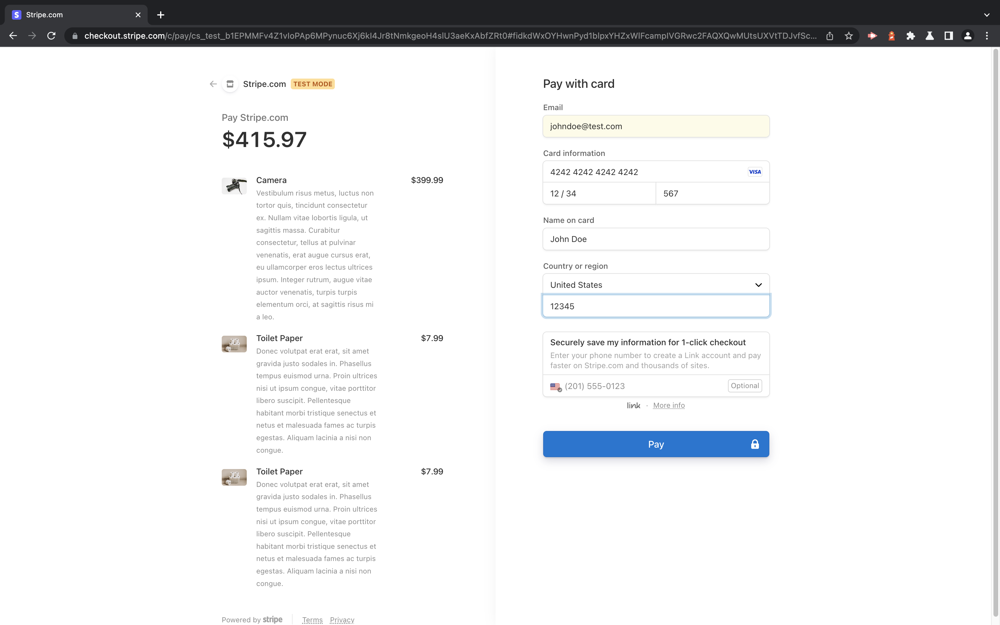
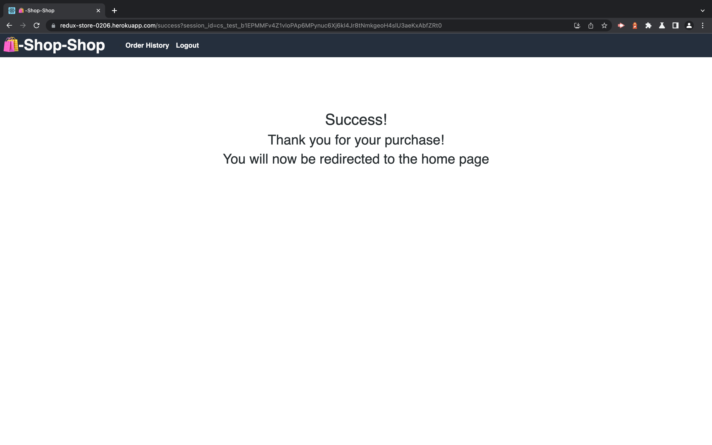
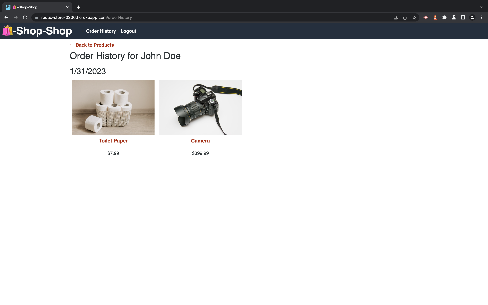
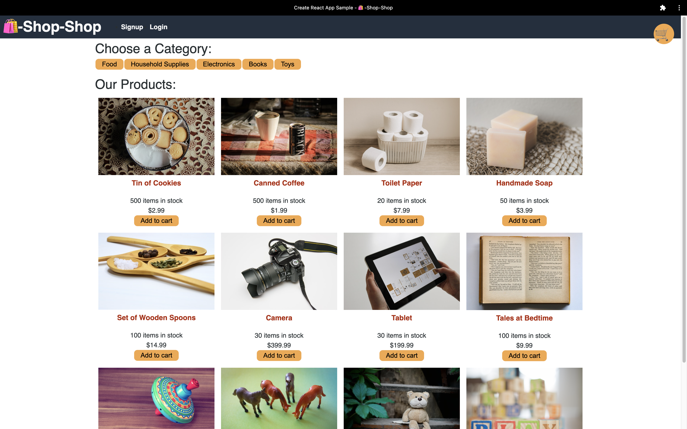

# Redux Store

 

## License

 

[This application is under the MIT license](https://opensource.org/licenses/MIT)

 

## Deployment Link

 

[Deployment](https://redux-store-0206.herokuapp.com)

 

☝🏻 Click there!

 

## Table of Contents

- [Redux Store](#redux-store)
  - [License](#license)
  - [Deployment Link](#deployment-link)
  - [Table of Contents](#table-of-contents)
  - [Description](#description)
  - [Installation](#installation)
  - [Usage](#usage)
  - [Badges](#badges)
  - [Questions](#questions)
    - [GitHub](#github)
    - [Email](#email)

<small><i><a href='http://ecotrust-canada.github.io/markdown-toc/'>Table of contents generated with markdown-toc</a></i></small>

## Description

 

**Redux Store** is an e-commerce platform that is a single-page-application, a progressive-web-application and a MERN Stack application. The front end was built using React and Redux to handle global state. The back end was built using Apollo Server, GraphQL to handle mutations and queries, Express.js, mongoDB, the Mongoose ODM, and Node.js. IndexedDB is used for offline functionality and Stripe checkout is used for "payment" (test mode) functionality as well.

 

## Installation

 

Clone the repository to your local machine, open your terminal, and navigate to the root folder of the **Redux Store** repository. To install the necessary dependencies, run `npm i` in your command-line terminal. Repeat this process two more times, first navigating to the server folder and second navigating to the client folder (running `npm i` both times).

 

## Usage

 

1. To begin using **Redux Store**, sign up by entering first name, last name, a valid email address and a secure password.

 

 

2. Once you sign up you'll be taken to the homepage. Here you can view all of the products for sale, products by category, add an item (or items) to your cart, delete an item (or items) from your cart, and increase or decrease the quantity of an item in your cart.

 

 

 

3. Once you're finished shopping you're ready to proceed to checkout! Please enter a valid email address, `4242 4242 4242 4242` for the card number, any future date for the expiration date, any 3 digit number for the CVC, your full name, any valid United States zip code and then press the `pay` button. When your payment has successfully processed you'll receive a success message. Simply click on `Order History` in the navigation menu to view your completed transactions.

 

 

 

 

4. **Redux Store** can even be installed for offline functionality as seen here!

 

 

## Badges

 

 

 

 

 

 

 

 

 

 

 

 

 

 

 

 

 

 

 

## Questions

 

If you have any additional questions, you can reach me at:

 

### GitHub

 

 

[jesterb0206](https://www.github.com/jesterb0206)

 

### Email

 

 

jesterb@seattleu.edu

 
